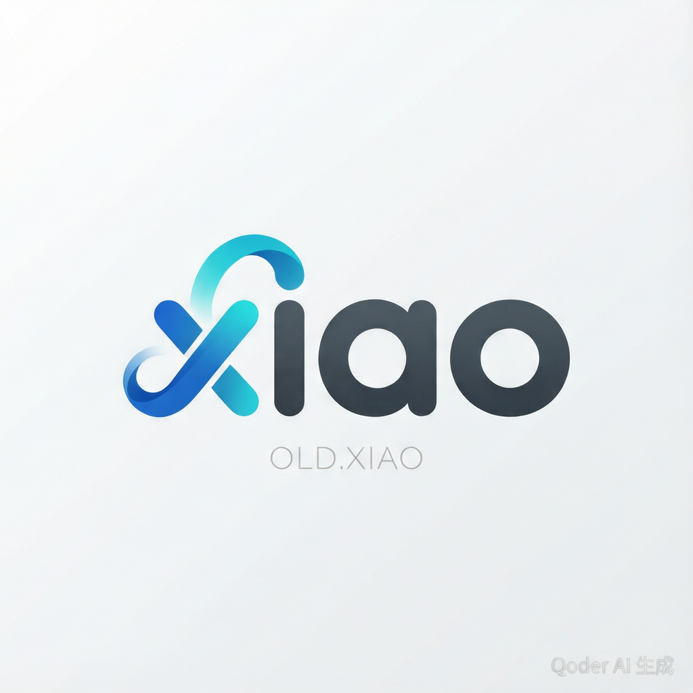
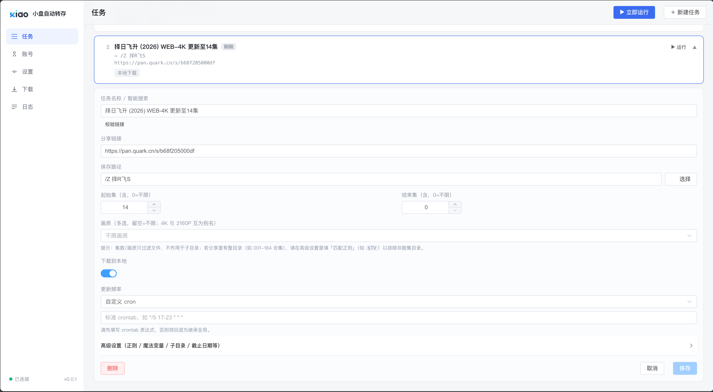
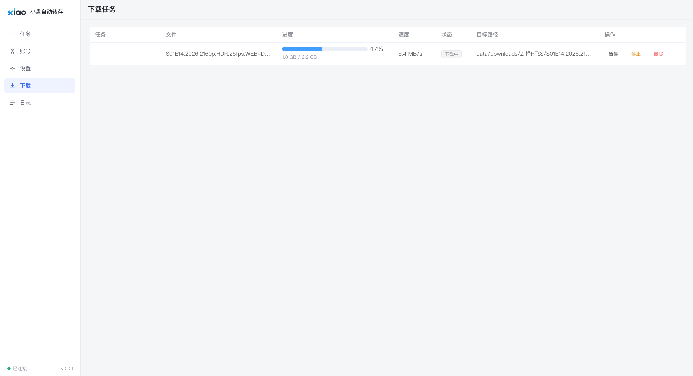
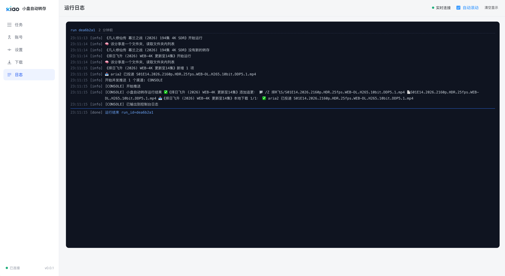
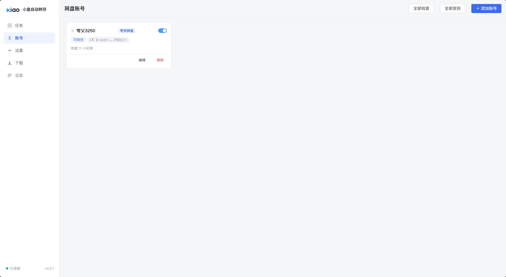

# xiao-pan-auto-save

<p align="center">
  
</p>

多网盘分享链接 **自动转存 / 追更** 系统。给网盘账号配置 Cookie，系统按计划任务自动检查
分享链接更新，把新文件转存到指定目录并按规则重命名，全程推送通知。

> 业务思路脱胎于 [quark-auto-save](https://github.com/Cp0204/quark-auto-save)（AGPL-3.0），
> 因为原理项目页面和操作方式都很不习惯所以进行升级优化
> 但架构与界面全部重写：FastAPI + SQLite + Vue3，网盘操作抽象为可插拔驱动层。

## 界面预览

| 任务 · 新建/编辑（基础字段 + 高级折叠） | 下载任务 · 实时进度与操作 |
| --- | --- |
|  |  |
| **运行日志 · 终端风格实时输出** | **网盘账号 · 多账号 / Cookie 掩码** |
|  |  |

- **任务表单**：默认只暴露高频字段（剧名/链接/保存路径、起始集/结束集、画质、下载到本地、更新频率），
  正则/魔法变量/子目录等个性化项收进「高级设置」。
- **下载页**：拆成 **进行中 / 历史** 两个 tab——进行中是实时进度与速度，支持暂停/继续/停止/删除
  （按模式差异化）；历史是落库的下载账本，可筛选、分页、按单个文件重下。

## 特性

- 🔌 **驱动抽象层**：任务按分享链接域名自动路由网盘驱动，加一个网盘 = 加一个文件
  （教程见 [docs/drivers.md](docs/drivers.md)）。当前已支持 **夸克网盘**，
  迅雷 / 123 / 百度 / 阿里 / 115 / 天翼 / 移动 / AList 驱动骨架已就位（即将支持）。
- 🔄 **追更引擎**：分享列表与目标目录差集比对只转新增；忽略扩展名去重（`01.mp4≈01.mkv`）；
  起始文件订阅（跳过老集数）；子目录追更（递归比对 / 删除重存两种模式）；链接失效自动标记并通知。
- ✨ **魔法重命名**：正则 + 替换式，内置 `$TV` 等魔法关键字与 `{TASKNAME} {SXX} {E} {II} {DATE}`
  等变量；`{II}` 依目标目录现状自动递增编号。
- ⏰ **调度**：APScheduler 全局 crontab + **任务级独立频率**（每 N 分钟 / 每周某天 / 自定义 cron），
  外加任务级 runweek（星期）/enddate（截止）过滤；转存阶段全局串行、下载阶段并行。
- 📣 **通知**：兼容原项目全部渠道协议（Server酱 / PushDeer / Bark / 钉钉 / 飞书 / Telegram /
  企业微信 / ntfy / 自定义 webhook 等 24 渠道），运行结果树形摘要聚合推送。
- 📥 **下载到本地**：转存成功的新文件可自动落盘——内置流式下载器（.part 断点保护、同大小跳过、
  并发控制、目录镜像/平铺）或投递 **Aria2 RPC**（协议兼容原项目，支持暂停模式）；下载完成后可自动
  触发 **Emby 媒体库刷新**。任务级"下载到本地/递归子目录"开关。每次下载都落一条 **历史账本**
  （状态、体积、目标路径、是否到位），失败的单文件可直接重下，见 [下载历史与失败重下](#下载历史与失败重下)。
- 🖥 **Web 管理**：任务卡片 + 展开编辑 + 星期胶囊；智能搜索建议（PanSou/CloudSaver 搜资源、
  验证链接、点选建任务）；文件选择器带面包屑、**分享目录树可逐层下钻浏览**与正则处理效果实时预览；
  SSE 实时运行日志；多账号管理。
- 🧩 **API 与油猴脚本**：Token 鉴权的 `/api/add_task`（兼容旧格式）与 `/api/v1/task/*`，
  附重写好的油猴脚本（`scripts/xiao-pan-auto-save.user.js`）：夸克分享页一键加任务。

## 快速开始（Docker）

```bash
git clone <本仓库> && cd xiao-pan-auto-save
docker compose up -d --build
# 浏览器打开 http://127.0.0.1:8432
```

1. **账号**页粘贴夸克 Cookie（签到需附移动端参数，格式 `cookie#kps=..&sign=..&vcode=..`）；
2. **设置 → 定时规则 / 通知渠道** 按需配置，点"发送测试"验证；
3. **任务**页新建任务（任务名输入几个字即可联网搜资源直接建任务），或"立即运行"看 SSE 日志。

公网部署请务必设置环境变量 `WEBUI_PASSWORD`。

### 下载到本地（可选 Aria2 提速）

内置流式下载器为单连接，夸克**免费账号**常被限速到 ~0.1 MB/s，整集大文件不友好。
需要更快落盘时，用 compose 里可选的 Aria2 服务（多连接突破单流限速）：

```bash
# 1) 连同 aria2 一起启动（aria2 默认不启动，靠 profile 开关）
ARIA2_SECRET=你的RPC密钥 docker compose --profile aria2 up -d --build
```

然后在 **设置 → 下载到本地**：模式选 `aria2`，RPC 地址填 `aria2:6800`，
密钥与上面的 `ARIA2_SECRET` 一致，下载目录用容器内路径 `/app/data/downloads`。

- aria2 与主服务共享同一 `./data:/app/data` 挂载点，应用提交的 `dir` 参数两边解析到同一目录，
  下载结果直接落到宿主机 `./data/downloads`。
- 只想跑主服务时照旧 `docker compose up -d`，aria2 不会被拉起。
- 换 VIP 账号是限速的根治手段；aria2 多连接对免费账号通常也有数倍提升。

#### 主服务跑在宿主机（uvicorn）+ 容器化 aria2

若主服务不在 compose 里（例如无法构建镜像、直接 `uvicorn backend.main:app` 跑在宿主机），
上面的 `aria2:6800` 内网名和 `./data:/app/data` 挂载都对不上——因为宿主机应用提交的
`addUri dir` 是**宿主机绝对路径**，容器必须把 `data` 挂到**同一绝对路径**才能落盘。用这条：

```bash
DATA_ABS="$(pwd)/data"   # 宿主机上本仓库 data 目录的绝对路径
docker run -d --name xiao-pan-aria2 --restart unless-stopped \
  -v "$DATA_ABS:$DATA_ABS" \
  -p 127.0.0.1:6800:6800 \
  -e SECRET= -e PUID=0 -e PGID=0 -e RPC_PORT=6800 \
  -e DOWNLOAD_DIR="$DATA_ABS/downloads" \
  -e ARIA2_ARGS="--max-connection-per-server=5 --split=5 --min-split-size=1M" \
  p3terx/aria2-pro
```

然后在 **设置 → 下载到本地**：模式 `aria2`，RPC 地址 `127.0.0.1:6800`。
注意 `p3terx/aria2-pro` 在 `SECRET` 为空时会用内置默认密钥 `P3TERX`，故密钥填 `P3TERX`
（或改成你自己的值并保持一致）。端口只绑 `127.0.0.1`，不对外暴露，单机本地用足够安全。

- aria2 不可达时，下载会自动**降级到内置下载器**，不会因此下不到东西。
- 换 VIP 或想根治限速同上。

### 下载历史与失败重下

下载页分 **进行中 / 历史** 两个 tab：进行中只看实时在跑的任务（内置 + aria2 活动队列，1.5s 刷新），
历史则是写进 SQLite 的下载账本——一条记录 = 一次下载动作的完整生命周期，重启后端也不丢。

- **筛选与分页**：按状态（排队/下载中/完成/失败/跳过/已停止，可多选）、按任务、按文件名或目标路径
  关键词过滤，默认每页 50 条。关键词按字面匹配（`100%` 不会被当成通配符）。
- **`文件` 列（到位校验）**：每次查询历史时对当页目标路径做一次 `stat`——
  **在** = 文件确实是常规文件；**已丢失** = 路径上已经没有这个文件；**未校验** = 读不到（权限异常、
  挂载丢失、路径是目录等），不当成丢失，避免把"暂时看不了"误报成"文件没了"。
- **单文件重下**：历史任意一行点「重下」，后端**重新取一次直链**（老直链会过期），沿用记录里的
  fid + 账号（账号被删/停用则回落到该网盘可用的主账号），并**打回原来的目标路径**
  （`dest_path` 原样，不受后来改动下载根目录/覆盖路径的影响）。文件已经在原地且大小相符 →
  记为**跳过**，不会重复占盘。一次尝试新增一行，旧记录不改写，方便看出第几次才成功。
  立即返回的提示只代表"已开始"，内置下载器一个 4K 文件可能跑几小时。
- **aria2 的终态**：aria2 完成后从活动队列消失，因此历史页每次查询时对未完成记录做一次对账——
  逐个 gid 问 `aria2.tellStatus`（真 aria2 没有 `tellDownloadResult`，`system.multicall` 也不接受带 token 的子调用），
  `complete` 判**完成**、`error`/`removed` 判**失败**并带上 daemon 给的理由；问不到（gid 已被丢弃、RPC 不可达）
  再看文件是否到位；两者都确认不了的，24 小时内的记录保持 `排队/下载中`，
  超过 24 小时判为 `失败`（对账超时），避免后端重启后遗留的记录永远挂着。
- **保留策略与清理**：设置 → 下载设置里的「历史保留」可选 最近 30/90/180 天或永久保留（默认 90 天）。
  过期终态记录由调度器**启动时 + 每天**自动清理（只删记录，绝不动磁盘上已下载的文件）。历史页的
  「清理」下拉还支持手动操作：按保留策略清理 / 只清失败记录 / 清空全部，均需二次确认，清理结果以
  "已清理 N 条"回显。

两点如实说明的边界：

1. **账本只记录真正开始的下载**：写库点在"取到直链、开始下载"之后，所以转存成功但**取直链失败**、
   驱动不支持下载、aria2 投递失败这类前置失败不会出现在历史里，只能在任务的运行日志中看到。
   同一路径的并发重下由**两层守卫**拦截：账本里该路径还有未收口的行时，「重下」直接返回 409；
   而"取直链窗口"里账本行尚未写入，这期间的第二次点击由**进程内**的同路径在途登记兜住，被拦的
   尝试不落账本、不碰正在写的文件。在途登记只活在单进程内（本项目默认单 uvicorn worker），跨进程并发不在拦截范围；
   且它只覆盖内置下载器——aria2 模式不在本进程落盘，同路径投递的去重归 aria2 daemon 自己判。
2. **aria2 排队很深的记录可能晚点才对账**：进行中列表只取 `tellWaiting` 的前 200 条，排在 200 条之后的
   作业既不在活动队列、结果也还没产生，只能等它进入前 200 条或文件到位后才被确认；超过 24 小时仍未
   确认的会按上面的规则收口成失败。

## 从 quark-auto-save 迁移

设置 → 旧配置导入：粘贴原 `quark_config.json` 内容，预览确认后一键导入。
映射规则：`cookie(list)`→夸克账号（多个）、`tasklist`→任务
（`update_subdir_resave_mode`→重存模式；插件 `addition` 不支持，会被忽略并列出）、
`crontab / push_config / magic_regex / source`→对应设置项。也可 API 调用：

```bash
curl -X POST http://127.0.0.1:8432/api/migrate -H 'content-type: application/json' \
  --data "{\"config\": $(cat quark_config.json), \"overwrite\": true}"
```

## 本地开发

```bash
py -3.11 -m venv .venv && .venv/Scripts/activate   # Windows；Linux 用 python3 -m venv
pip install -e ".[dev]"
uvicorn backend.main:app --reload --port 8432      # 后端
cd frontend && npm install && npm run dev          # 前端（vite 代理 /api → 8432）
pytest -q && ruff check backend                    # 测试与 lint
```

## 对外 API

- `POST /api/add_task?token=…` —— 兼容原项目油猴脚本格式（`taskname/shareurl/savepath/pattern/replace/ignore_extension/startfid/update_subdir/update_subdir_resave_mode/runweek/enddate`）
- `GET|POST /api/v1/task/list|add|update|run` —— JSON `{success, code, message, data}`
- Token 在 设置 → API 中生成（完整 token 仅创建时展示一次）。

## 相关文档

- [为新网盘写驱动](docs/drivers.md)（含各网盘接入要点与难度评估）
- [从 quark-auto-save 迁移](docs/migrate-from-quark-auto-save.md)

## 声明

本项目仅供学习与个人备份用途，请遵守各网盘服务条款，控制请求频率（默认每天 1-2 次足够）。

## License

AGPL-3.0-only © xiao-pan-auto-save contributors
